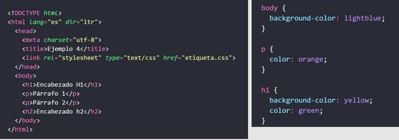
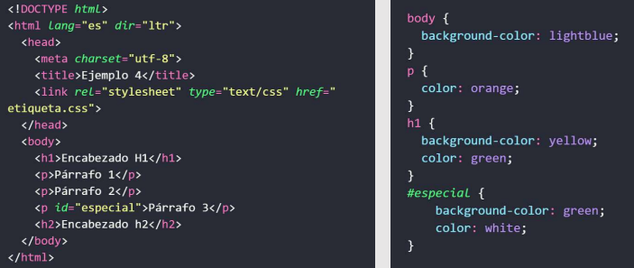
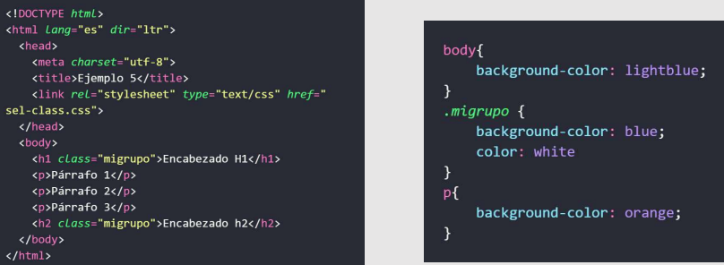

# 💻 CLASE 08

## 📎 REPASO, ¿QUÉ LLEVAMOS VISTO?
- **Estructura básica html** `[ <html> <head> <body> ]`
- **Encabezados y títulos** `[ <h1> ... <h6> ] [ <title> ]`
- **Enlaces** `[ a href="*enlace.com*" ]`
- **Párrafos** `[ <p> ]`
- **Salto** `[ <br/>]`
- **Línea** `[ <hr/> ]`
- **Comentarios** <!-- comentario -->
- **Diferenciar entre etiquetas semánticas y no semánticas** `[ <strong> / <b> ]` y `[ <em> / <i> ]`
- **Imágenes**`[  ]`
- **Listas** `[ <li> <ul> <ol> colspan="" rowspan="" ]`
- **Formularios** `[ <form> <input> <label> <select> <option> <textarea> ] [text, radio, submit, password, reset, file, checkbox, size, multiple, action, method, name, for]`
- **Elementos en bloque y línea** `[ <div> <span> ]`

- **Para identificar un elemento único** `Id = ""`
- **Identificador múltiple** `class = ""`
- **Atributos para enlaces** `href = "*url*" , target = "*_self, _blank, _parent, _top, external*", rel="*sponsored, ugc, nofollow*"`

**HTML5**
- **Para estructurar la página** `[ <header> <nav> <aside> <article> <section> <main> <footer> ]`
- **Audio** `[ <audio src=""> ] [ controls, autoplay, loop, preload ]`
- **Video** `[ <video src=""> ] [ controls, type, autoplay, loop ]`
- **Video de YouTube** `[ conseguir código de inserción del video en YouTube]`
- **Contenido ilustrativo** `[ <figure> ] [ img, video, audio, pre, code, table, etc.]`
- **Para dibujar gráficos** `[ <canvas> ]`

- **Etiquetas HTML5 para formularios** `[ color, date, datetime, datetime-local, email, month, number, range, search, tel, time, url, week ]`
- **Atributos HTML5 para formularios** `[ required, placeholder, autocomplete, autofocus, pattern, min, max, step, size, readonly, disabled ]`

- **Barras de progreso** `[ <progress> ] [ min, max, value]`

- **Etiqueta ARIA: aria-label** 
- **Etiquetas meta para el SEO** 
```
<!DOCTYPE> 
<meta charset="UTF-8"> 
<meta name="viewport" content="width=device-width, initial-scale=1.0"> 
<meta name="description" content=“Breve descripción del contenido de la página."> 
<meta name="keywords" content="HTML5, meta, etiquetas, SEO">
<meta name="author" content="Tu nombre o empresa">
 <meta http-equiv="Cache-Control" content="no-cache">
<meta http-equiv="refresh" content="10;url=https://ejemplo.com">
 <meta name="robots" content="index, follow">
<meta http-equiv="content-language" content="es">
```

## 📎 TEORÍA
### QUÉ ES CSS
**CSS «hojas de estilo en cascada» (*Cascading StyleSheets*)**: es un lenguaje que maneja el diseño y presentación de las páginas web, es decir, cómo lucen cuando un usuario las visita. Funciona junto con el lenguaje HTML que se encarga del contenido básico de las páginas.

*Se les denomina hojas de estilo «en cascada» porque puedes tener varias hojas y una de ellas con las propiedades heredadas (o «en cascada») de otras.*

- Con HTML se define la **estructura**
- Con CSS se define **el estilo**

## 📎 CÓDIGO
### DARLE ESTILO A LAS ETIQUETAS HTML
Vamos a hacerlo preferiblemente (buena praxis) por medio de una hoja de estilo externa.

- Vamos a linkear un archivo css nuevo llamado **"style.css"** a nuestro html mediante:<br>
`<link rel="stylesheet" href="css/style.css">`

### SELECTORES
El selector es el que permite seleccionar las etiquetas HTML a las que aplicar el estilo. Para esas etiquetas se especifican las propiedades de estilo que se quieren modificar, y el valor que asignarles.
- Podemos seleccionar por **etiqueta**:
<br>
- Seleccionar por identificador único **(id)**:
<br>
- Seleccionar por grupo de la misma **clase**:


## 📎 TAREAS
📌 **Jueguito CSS**<br>
- Juega a este juego: https://flukeout.github.io/

## 📎 EXTRAS
- Podéis jugar con el inspector para experimentar con los estilos directamente en el navegador (F12)
- La mejor página web del mundo mundial: https://gvanrossum.github.io/