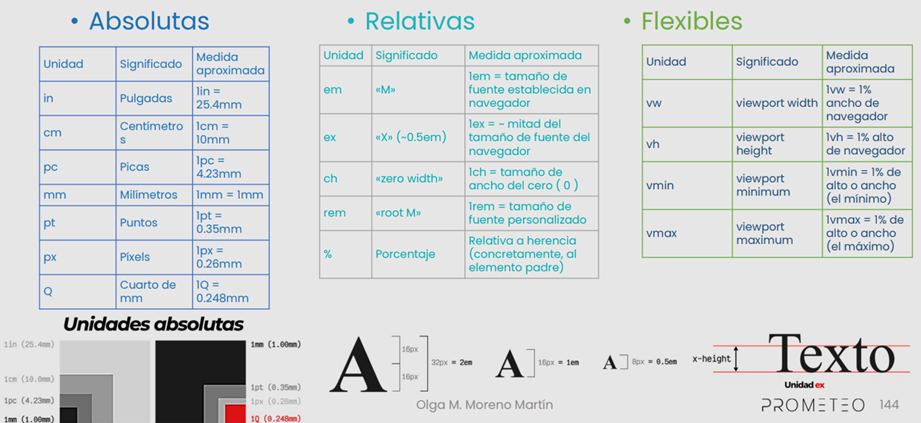
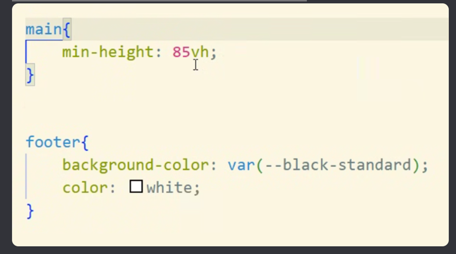
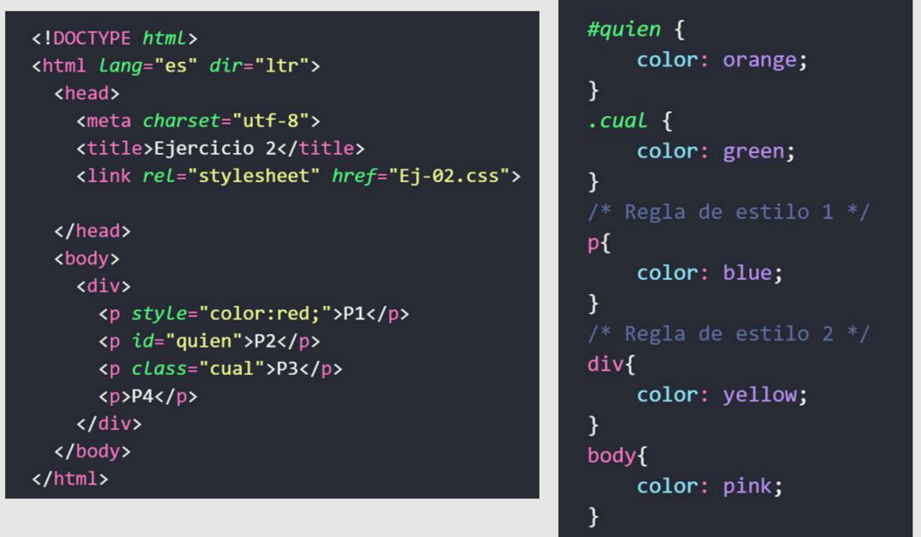

# 💻 CLASE 09
## 📎 TEORÍA
### REGLAS DE APLICACIÓN DE ESTILO (cortesía de Olga)

**1. El último será el primero** 
Cuando se aplican valores contradictorios a la misma propiedad de un elemento, el último estilo definido es el que prevalece. 

**2. Inline es INmodificable** 
El estilo aplicado directamente sobre las etiquetas HTML, en el fichero html, tiene prioridad sobre el estilo aplicado en la hoja de estilo. O visto de otra manera, si definimos el estilo en las etiquetas, no podremos modificarlo con ninguna hoja de estilo.

**3. El que no tiene, hereda** 
Si NO está definido un estilo de un elemento, lo heredará del elemento que lo contiene.

**4. El que no tiene hereda del más cercano** 
Si un elemento NO tiene un estilo definido, lo hereda del elemento superior más cercano que lo contiene, y que sí tiene estilo definido.

**5. Primero yo, luego mi clase y luego el resto** 
Cuando a un elemento se le aplica el mismo estilo desde diferentes reglas, la prioridad la tienen la regla aplicada al identificador único. Luego se aplica el estilo de la clase, y finalmente el resto de estilos

**6. Yo, pero no sin mi atributo** 
Selector de atributo. 
- Los elementos en una página con el atributo especificado. 
- `img[src]` Selecciona `` pero no ``

**7. Yo, pero en un estado determinado** 
Selector de pseudoclase 
- Los elementos especificados, pero solo cuando esté en el estado especificado, por ejemplo cuando el puntero esté sobre él. 
- a:hover Selecciona `<a>`, pero solo cuando el puntero esté sobre el enlace. ( : ) 
- p::first-letter Los elementos especificados, pero solo una parte de ellos. ( :: )

**8. Puedo quererlos a todos** 
Hay un selector universal, para poder seleccionar todos los elementos HTML podemos usar

### SINTAXIS VARIAS
**Anidamiento o nesting** 
Es una forma de escribir reglas dentro de otras reglas, siguiendo la estructura del HTML, para hacer el código más limpio y legible. Permite agrupar selectores relacionados sin repetirlos continuamente.

**Notaciones** 
Las notaciones en CSS son diferentes formas válidas que tiene CSS para representar valores, como colores, medidas, tiempos, funciones, etc.

**Case** 
Son convenciones de escritura que se usan para nombrar variables, clases, funciones o selectores. En CSS se usan especialmente en clases, IDs y variables

 

**Medidas** 
 

**Truco para que el footer nos quede siempre abajo** 
 

## 📎 TAREAS
📌 **Mini-práctica en clase** 
- ¿En qué color se renderizarán los textos P1, P2, P3 y P4.?
- ¿Cuál sería el color de P4 si se elimina la regla de estilo 1?
- ¿Cuál sería el color de P4 si se eliminan las reglas de estilo 1 y 2?
 

## 📎 EXTRAS
- Extensión del cuentagotas para chrome: https://chromewebstore.google.com/detail/eye-dropper/hmdcmlfkchdmnmnmheododdhjedfccka?hl=es&pli=1
- Herramienta para comprobar compatibilidades web: https://caniuse.com/