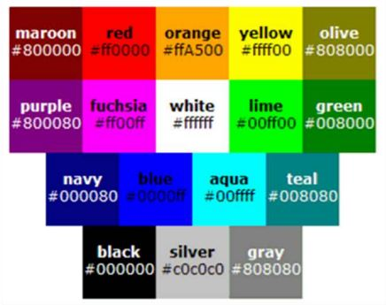

[**Clase siguiente →**](resumen-clase11.md)

[**← Clase anterior**](resumen-clase09.md)
# 💻 CLASE 10
## 📎 TEORÍA

### COLORES
- En **CSS** encontramos 17 palabras para referirse a 17 colores específicos. Al comprender una gama bastante limitada, esto no suele utilizarse en sitios reales.
 
- Tenemos también el modelo **RGB** en el que un color se ve definido por 3 valores: **R** (Red), **G** (Green) y **B** (Blue). Podemos hacerlo de manera: 
· Numérico: `p { color: rgb(71, 98, 176); }`  
· Porcentual: `p { color: rgb(27%, 38%, 69%); }` 
· Hexadecimal: `p { color: #4762B0; }` (*Recomendado*)

### DEGRADADOS
- Los navegadores soportan dos tipos de degradados: `linear-gradient` y `radial-gradient`
- Los degradados admiten transparencias (*que no es lo mismo que opacidad*)
- Hay un **nuevo degradado**: los degradados cónicos (`conic-gradient`)

## 📎 TAREAS
📌 **Ejercicio Gradientes** 
- Crea esta página web para practicar degradados:
 

[**Clase siguiente →**](resumen-clase11.md)

[**← Clase anterior**](resumen-clase09.md)