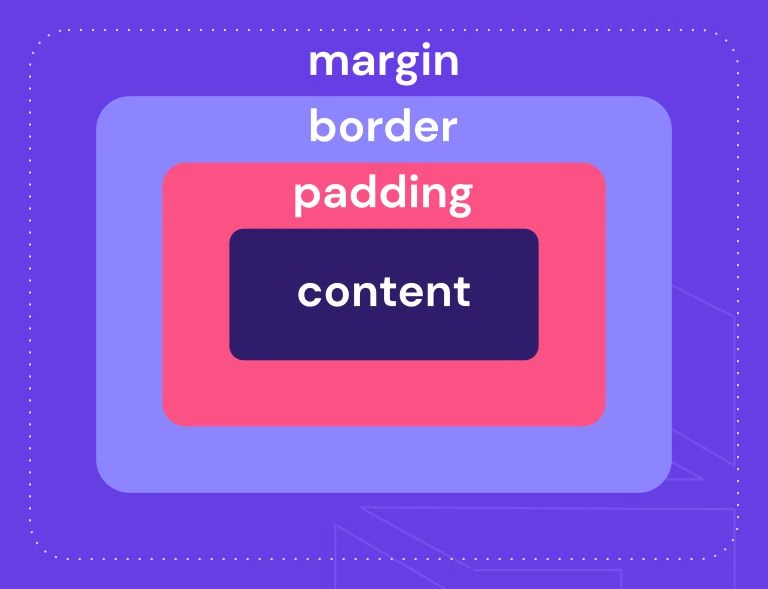
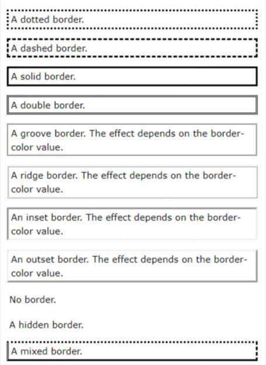

[**Clase siguiente →**](resumen-clase12.md)

[**← Clase anterior**](resumen-clase10.md)
# 💻 CLASE 11
## 📎 TEORÍA

### MODELOS DE CAJA
Los elementos de HTML se tratan cono **cajas**. Cada una de estas cajas se compone de 4 partes:
- Contenido
- Relleno (*Padding*)
- Borde
- Margen

<br>

## 📎 CÓDIGO
### JUGANDO CON LAS PROPIEDADES DE UN `<p></p>`
- **Activamos el borde**, de momento dejamos las propiedades del párrafo en 0, pero activamos el borde y le damos un color azul
```
p{
    margin: 0px;
    padding: 0px;
    border: solid;
    border-color: blue; 
}
```
- **Añadimos relleno**, poniendo un padding de 10px
```
p{
    margin: 0px;
    padding: 10px;
    border: solid;
    border-color: blue; 
}
```
**Añadimos margen**, poniendo un margin de 10px
```
p{
    margin: 10px;
    padding: 10px;
    border: solid;
    border-color: blue; 
}
```
### PROPIEDAD BORDER 
**El radio y el ancho:**
- border-radius 
- border-width

**Se pueden seleccionar partes del borde:**
- border-left 
- border-right 
- border-top 
- border-bottom

**Se puede definir un borde de la siguiente forma:**
- border-width 
- border-style: T style R style B style L style (max 4 estilos) 
- border-color 
- border: Tpx Rpx Bpx Lpx STYLE COLOR;

**Valores en border-style:**
- dotted
- dashed
- solid
- double
- groove
- ridge
- inset
- outset
- none
- hidden



### PROPIEDAD OUTLINE
Las propiedades relacionadas con el contorno son las siguientes:
- outline style (*dotted, dashed, solid double,groove, ridge, inset, outset, none, hidden*)
- outline-color
- outline-width
- outline-offset (espacio entre el contorno y el borde)

### FONDO O BACKGROUND
Permite definir todas las propiedades de fondo de un elemento en una sola linea:
- `background-color` nombres de colores (red), valores hexadecimales (#ff0000), valores RGB o RGBA, y valores HSL o HSLA.
- `background-image` una o más imágenes de fondo para un elemento. Puedes usar la URL de una imagen o incluso un valor de gradiente.
- `background repeat` cómo se repetirá la imagen de fondo<br>
→ ( *repeat, repeat-x, repeat-y, no-repeat*)
- `background position` la posición inicial de la img de fondo, usando valores como palabras clave<br>
→ (*top, right, bottom, left, center*), valores porcentuales o medidas (*px, em,* etc.).
- `background-size`tamaño de la imagen de fondo<br>
→ (*cover, contain*)
- `background-attachment` determina si la imagen de fondo se desplaza con el contenido de la página o permanece fija<br>
→ (*scroll, fixed, local*)
- `background-origin` área de posicionamiento del fondo<br>
→ (*padding-box, border-box, content-box*)
- `background-clip` establece si el área de fondo se extiende bajo el borde, el padding o el contenido.<br> 
→ (*padding-box, border-box, content-box*)

## 📎 TIPS
👉 El baile de los valores de las propiedades: `arriba, derecha, abajo, izquierda` chachachá

[**Clase siguiente →**](resumen-clase12.md)

[**← Clase anterior**](resumen-clase10.md)