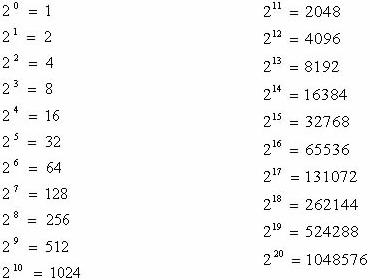
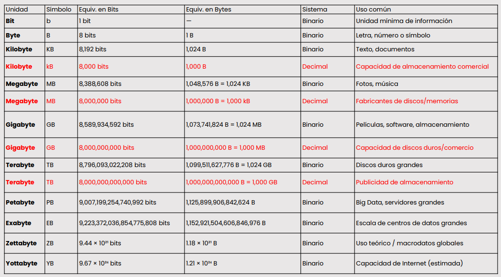

[**Clase siguiente →**](resumen-clase02.md)

# 💻 CLASE 8
## 📎 TEORÍA
### UNIDADES DE ALMACENAMIENTO DE DATOS
| Unidad        | Abreviatura | Descripción |
|---------------|-------------|-------------|
| **Bit**       | b           | Unidad básica de información |
| **Byte**      | B           | Representa un solo carácter |
| **Kilobyte**  | KB          | Almacena documentos de texto simples |
| **Megabyte**  | MB          | Almacena archivos multimedia de menor tamaño |
| **Gigabyte**  | GB          | Almacena películas y software |
| **Terabyte**  | TB          | Discos duros grandes. Almacena grandes cantidades de datos |
| **Petabyte**  | PB          | Big Data. Almacena conjuntos de datos extremadamente grandes |
| **Exabyte**   | EB          | Almacena datos a escala de centros de datos |
| **Zettabyte** | ZB          | Almacena datos a escala global. Uso teórico / macrodato globales |
| **Yottabyte** | YB          | Capacidad de Internet (estimada) |

### SISTEMAS DE NUMERACIÓN: DECIMAL, BINARIO Y HEXADECIMAL
**DECIMAL**
- Base 10
- Utiliza diez dígitos: 0-9
- Cada posición representa una potencia de 9
- **Ejemplo:** 245 = 2×10² + 4×10¹ + 5×10⁰

**BINARIO**
- Base 2
- Solo usa dos dígitos: 0-1
- Cada posición representa una potencia de 2
- **Ejemplo:** 1011 = 1×2³ + 0×2² + 1×2¹ + 1×2⁰ = 11 en decimal

**HEXADECIMAL**
- Base 16
- Utiliza diez símbolos: 0-9 y A-F (A=10, B=11, ..., F=15)
- Cada posición representa una potencia de 16
- **Ejemplo:** 1A3 = 1×16² + 10×16¹ + 3×16⁰ = 419 en decimal

### SISTEMAS DE NUMERACIÓN EN REDES
 - **Direcciones IP >** Son como las direcciones de las casas en Internet, y se expresan en decimal para que las entendamos, aunque las computadoras las traducen a binario.
- **Máscaras de subred >** Son como mapas que dividen las redes en secciones más pequeñas, y se usan en formato binario y decimal.
- **Direcciones MAC >** Son como huellas dactilares únicas para cada dispositivo en la red, y se expresan en hexadecimal para que sean más cortas

## 📎 PRÁCTICA
### CONVERTIR DE DECIMAL A BINARIO Y VICEVERSA
| Potencia de 2 | 2^4 | 2^3 | 2^2 | 2^1 | 2^0 |
|---------------|-----|-----|-----|-----|-----|
| Valor binario |  1  |  1  |  0  |  0  |  1  |
| Multiplicación| 16×1| 8×1 | 4×0 | 2×0 | 1×1 |
| Resultado     | 16  |  8  |  0  |  0  |  1  |

**Suma de resultados:** 16 + 8 + 0 + 0 + 1 = 25  

**Conclusión:** El número binario `11001` equivale al decimal `25`.

Potencias: 

## 📎 ALGUNOS TIPS
👉 **Cuidado con los vendedores**

*Básicamente: lo rojo representa las unidades en sistema decimal (base 10), que suelen usar las empresas para vender discos, memorias y almacenamiento, porque los números suenan más grandes que en el sistema binario (base 2).*

[**Clase siguiente →**](resumen-clase02.md)

