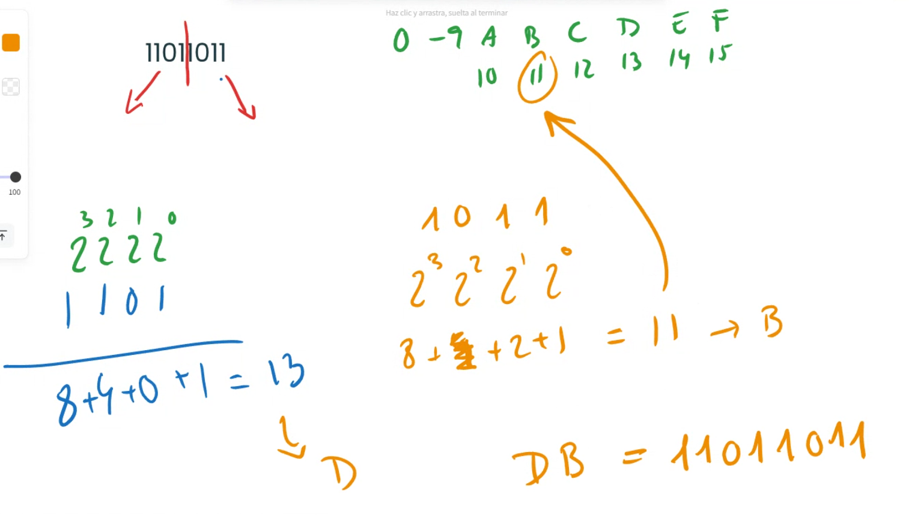

[**Clase siguiente →**](resumen-clase03.md)

[**← Clase anterior**](resumen-clase01.md)

# 💻 CLASE 2
## 📎 TEORÍA
### MODELO OSI
El modelo de referencia OSI (Open Systems Interconnection) es un marco conceptual que describe cómo se comunican los sistemas en red. Divide el proceso de comunicación en siete capas:
| Capa | Función | Ejemplos |
|------|---------|----------|
| **1. FÍSICA** | Cables, señales eléctricas y conectores (bit) | Cables, Conectores, Hubs |
| **2. ENLACE DE DATOS** | Detecta errores y usa direcciones MAC para enviar datos sin chocarse | Ethernet, PPP, HDLC |
| **3. RED** | Aquí vive IP: decide la ruta que tomarán los paquetes | IP, ICMP, ARP |
| **4. TRANSPORTE** | Controla el envío de datos (TCP u UDP: fiable o rápido) | TCP, UDP, SCTP |
| **5. SESIÓN** | Gestiona las conexiones entre dispositivos (“¿sigues ahí? – “sí, sigo”) | NetBIOS, RPC, PPTP |
| **6. PRESENTACIÓN** | Traduce y cifra datos para que todo tenga sentido | SSL/TLS, ASCII, JPEG |
| **7. APLICACIÓN** | Donde viven tus apps: navegador, correo, WhatsApp y demás | HTTP, HTTPS, FTS |

### MODELO OSI - PDUs
**PDU (Protocol Data Unit o Unidad de Datos de Protocolo)** es la forma que toma la información en cada capa del modelo OSI. Cada capa añade o interpreta información para cumplir su función:

**1. Física:** Bits 
**2. Enlace:** dirección MAC → tramas (frames) 
**3. Red:** dirección IP → paquetes 
**4. Transporte:** segmento/trama  → segmento (TCP) datagrama (UDP) 
**5. Sesión:** datos  → datos 
**6. Presentación:** datos  → datos 
**7. Aplicación:** datos  → datos

### MODELO TCP/IP
**El modelo TCP/IP (Transmission Control Protocol / Internet Protocol)** es un conjunto de  protocolos que define cómo se comunican los dispositivos en una red, especialmente en Internet. Se divide en capas:
| Capa | Función | Información |
|------|---------|----------|
| **1. ACCESO A RED** | Física / Enlace de Datos | Tramas / bits |
| **2. INTERNET** | Red | Datagramas / IP|
| **3. TRANSPORTE** | Transporte | Segmentos |
| **4. APLICACIÓN** | Sesión / Presentación / Aplicación | Datos |

### TOPOLOGÍAS DE RED
- **Estrella >** Sencilla y común, pero vulnerable a fallos del switch central.
- **Bus >** Obsoleta debido a colisiones y baja escalabilidad.
- **Anillo >** Interesante para recuperación automática, pero menos usada en acceso.
- **Malla >** Alta disponibilidad con múltiples caminos redundantes, pero costosa.
- **Híbrida >** Mezcla de topologías, a menudo la opción más realista para empresas.

## 📎 PRÁCTICA
### CONVERTIR DE BINARIO A HEXADECIMAL Y VICEBERSA
**1.**	Agrupa dígitos en bloques de 4 empezando por la derecha 
**2.**	Si el último bloque tiene menos de 4 dígitos, añade ceros a la izquierda 
**3.**	Convierte cada bloque binario en su equivalente hexadecimal 
**4.**	Combina los valores hexadecimales para obtener el resultado final

## 📎 ALGUNOS TIPS
👉 **Resumen de conceptos vistos hoy**
- **Cables Ethernet:** es un tipo de cable de red que conecta dispositivos (como computadoras, routers o switches) para transmitir datos mediante señales eléctricas dentro de una red local (LAN).
- **Cables de fibra óptica:** es un medio de transmisión que utiliza hilos de vidrio o plástico muy delgados para enviar datos como pulsos de luz, permitiendo velocidades muy altas y largas distancias con mínima pérdida de señal.
- **IP:** (Internet Protocol) es una dirección numérica única que identifica a un dispositivo dentro de una red para poder enviar y recibir datos. Puede ser IPv4 (ej. 192.168.1.1) o IPv6 (ej. 2001:0db8::1).
- **ICMP:** (Internet Control Message Protocol) es un protocolo de red usado para enviar mensajes de control y diagnóstico en redes IP, como notificar errores de entrega o comprobar la conectividad (por ejemplo, con el comando ping).
- **TCP:** es un protocolo de comunicación que funciona sobre IP y se encarga de establecer conexiones fiables entre dispositivos, asegurando que los datos lleguen completos, en orden y sin errores.
- **UDP:** es un protocolo de comunicación sin conexión que envía datos rápidamente sin comprobar si llegaron correctamente, lo que lo hace más veloz que TCP pero menos fiable.
- **HTTP:** (HyperText Transfer Protocol): protocolo usado para transferir información en la web; no cifra los datos, por lo que es menos seguro.
- **HTTPS:** (HyperText Transfer Protocol Secure): versión segura de HTTP que usa cifrado SSL/TLS, protegiendo la confidencialidad e integridad de los datos (ej. contraseñas, pagos en línea).
- **DNS:** (Domain Name System) es un sistema que traduce nombres de dominio legibles por humanos (como www.ejemplo.com) en direcciones IP que las computadoras usan para comunicarse en la red.
- **SMTP:** (Simple Mail Transfer Protocol) es un protocolo usado para enviar correos electrónicos entre servidores de correo en Internet.
- **QoS (Quality of Service o Calidad de Servicio**: es un conjunto de técnicas en redes que prioriza el tráfico de datos para asegurar un rendimiento adecuado, reduciendo retrasos, pérdidas o interrupciones en servicios críticos como voz o video.
- **jitter**: fluctuación de la velocidad de los paquetes
## 📎 TAREAS
📌 **Tarea**

[**Clase siguiente →**](resumen-clase03.md)

[**← Clase anterior**](resumen-clase01.md)