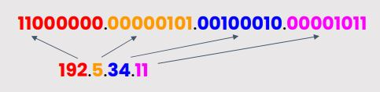
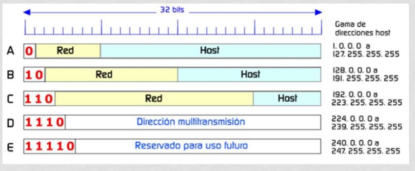
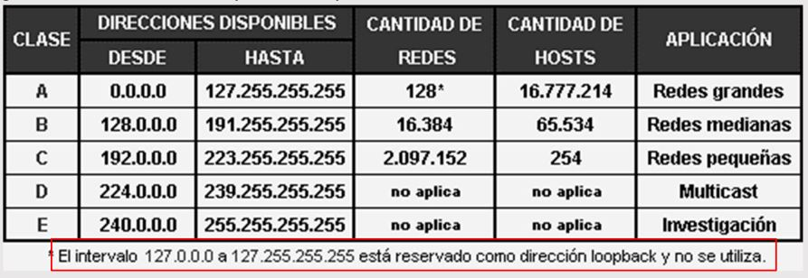

[**Clase siguiente →**](resumen-clase04.md)

[**← Clase anterior**](resumen-clase02.md)

# 💻 CLASE 3
## 📎 TEORÍA
### DIRECCIONAMIENTO IP
El direccionamiento IP es un esquema utilizado para identificar dispositivos dentro de una red basada en el PROTOCOLO IP (Internet Protocol). Cada dispositivo conectado a una red debe tener una dirección IP única para comunicarse con
otros dispositivos.

Consta de dos partes:
- **Identificador de red:** indica a qué red pertenece el dispositivo
- **Identificador de Host:** identifica el dispositivo dentro de la red

###IPv4 VS IPv6
# Diferencias entre IPv4 e IPv6

| Característica           | IPv4                           | IPv6                           |
|---------------------------|--------------------------------|--------------------------------|
| **Longitud de dirección** | 32 bits                        | 128 bits                       |
| **Formato de dirección**  | Decimal punteado (ej. 192.168.0.1) | Hexadecimal separado por dos puntos (ej. 2001:0db8:85a3::8a2e:0370:7334) |
| **Número de direcciones** | ~4.3 mil millones              | ~340 undecillones (3.4×10³⁸)  |
| **Configuración**         | Manual o DHCP                  | Automática (SLAAC) y DHCPv6   |
| **Encabezado**            | 20-60 bytes (más complejo)     | 40 bytes (más simple y eficiente) |
| **Seguridad**             | Opcional (IPSec)               | Incorporada (IPSec obligatorio) |
| **Fragmentación**         | Realizada por routers y host   | Solo por el host               |
| **Soporte de NAT**        | Sí, muy usado                  | No necesario (muchas direcciones disponibles) |
| **Compatibilidad**        | Amplia, soportada por todo     | Necesita compatibilidad con IPv4 (transición) |
| **Multicast**             | Limitado                        | Mejor soporte, reemplaza broadcast |

### PROTOCOLO IP · DIRECCIONES IP
Internet es un conjunto de redes gestionadas por distintas organizaciones conectadas entre sí utilizando el protocolo IP. El protocolo IP:
- Utiliza datagramas
- No está orientado a conexión
- Sin calidad de servicio (QoS)
- Sin garantía de entrega de paquetes

En cuanto a las direcciones IP...
- Cada host y router tienen una dirección IP única
- Las máquinas conectadas a redes tienen una IP por red
- Una dirección IP es un número binario de **32 bits** agrupados en **4 octetos** separados, cuyo valor máximo (de cada octeto) es 255:

 

**PARTES DE UNA DIRECCIÓN IP** 
Las direcciones IP están compuestas por dos partes:
- Identificador de Red – ID Network 
- Identificador de Dispositivo – ID Host

Clases:
- **A:** compañías telefónicas
- **B:** empresas grandes
- **C:** domésticas
- **D:** multitrasmisión, ejemplo, ejército
- **E:** investigación, ciertos canales seguros, uso futuro

**En resumen:** 
Las direcciones IP están compuestas por 32 bits divididos en 4 octetos de 8 bits cada uno.
A su vez, un bit o una secuencia de bits determinan la Clase a la que pertenece esadirección IP. Cada clase de una dirección de red determina una máscara por defecto, unrango IP, cantidad de redes y de hosts por red. 

## 📎 PRÁCTICA

## 📎 ALGUNOS TIPS
👉 **Resumen de conceptos vistos hoy**

## 📎 TAREAS
📌 **Tarea**

[**Clase siguiente →**](resumen-clase04.md)

[**← Clase anterior**](resumen-clase02.md)