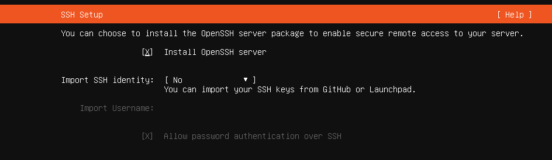

[**Clase siguiente →**](clase02.md)
# 💻 CLASE 01
## 📎 TEORÍA 
### ALGUNOS CONCEPTOS NUEVOS:
- **Sistema Operativo:** programa o conjunto de programas que permite una comunicación simple y sencilla entre hardware y usuario.

- **Kernell:** es el núcleo central del sistema operativo. Las aplicaciones se comunican con este por medio de llamadas al sistema.

- **Licencias de Software:** definen cómo se puede usar y distribuir un programa, distinguiendo entre software propietario y código abierto.

- **Llamadas al Sistema:** son los mecanismos que permiten a un programa pedirle servicios al sistema operativo, como acceder a archivos, usar la memoria, comunicarse por red o controlar dispositivos.

- **Linux:** es un sistema operativo libre y de código abierto basado en Unix, usado en computadoras, servidores, dispositivos móviles y sistemas embebidos.

- **Distribuciones de Linux:** son sistemas operativos completos que combinan el kernel Linux con programas, herramientas y un entorno gráfico.

- **Virtualización:** es una tecnología que nos permite crear versiones virtuales de recursos informáticos, como un sistema operativo, un servidor o un dispositivo de almacenamiento. En lugar de tener un SO atado a un hardware físico, podemos ejecutar múltiples sistemas operativos, cada uno en su propia máquina virtual (VM), sobre un único ordenador físico. Esto se logra gracias a una capa de software llamada **hipervisor**.

- **Hipervisor:** se encarga de repartir y gestionar los recursos del hardware físico (CPU, RAM, disco) entre las diferentes VMs. Existen 2 modelos principales:

- **Hipervisor tipo 1:** 
· Va directo al ordenador (al hardware). 
· No necesita Windows ni Linux debajo. 
· Se usa sobre todo en empresas porque da más rendimiento y seguridad. 
*Ejemplo: VMware ESXi, Hyper-V Server.* 
👉 Piensa que es como si el hipervisor fuera el propio sistema operativo del ordenador.

- **Hipervisor tipo 2:** 
· Necesita que antes tengas instalado un sistema operativo normal (Windows, Linux, etc.). 
· Funciona como un programa más que instalas en tu PC. 
· Es más fácil de usar, pero va más lento porque depende del sistema operativo que hay debajo. 
*Ejemplo: VirtualBox, VMware Workstation. *
👉 Piensa que es como instalar el WhatsApp o el Word, pero en lugar de eso instalas un programa para crear máquinas virtuales.

## 📎 ALGUNOS TIPS
👉 **Comandos**
- `uname` nos muestra información del sistema operativo y del kernel.
- `dmesg` muestra los mensajes del kernel (arranque del sistema, dispositivos, errores, hardware, USB, discos, etc.)
- `touch archivo2` te crea un archivo nuevo llamado "archivo2"
- `strace touch archive2` muestra qué es lo que pasa o qué llamadas al sistema suceden al ejecutar "touch archive2"
- Cheat Sheet de comandos de Linux: https://cheatography.com/romeodol/cheat-sheets/comandos-de-terminal-linux/

👉 **DistroSea**
- Nos permite probar diferentes distribuciones de Linux de manera online.
- Enlace: https://distrosea.com/es/

👉 **Contenedores (para alumnos avanzados)**
- Una evolución de la virtualización. 
- A diferencia de las VMs, los contenedores no virtualizan el hardware, sino el sistema operativo. 
- Todos los contenedores comparten el mismo kernel del SO anfitrión, pero cada uno tiene su propio espacio de usuario aislado. Esto los hace extremadamente ligeros y rápidos. 
- Docker es la plataforma de contenedores más popular.
- Enlace: https://www.docker.com/

## 📎 TAREAS
📌 **Sysinternals**
- Instalar las herramientas de Sysinternals
- Enlace:  https://learn.microsoft.com/es-es/sysinternals/downloads/sysinternals-suite

📌 **Virtualización**
- Instalar un gestor de virtualización como virtualbox 
- Enlace: https://www.virtualbox.org/

**Para habilitar la virtualización, hay que hacerlo desde la BIOS. Yo encontré la info por youtube, hay varios vídeos con distintas interfaces según el ordenador y tal. No es difícil de hacer.* 

📌 **Ubuntu**
- Descarga e intenta instalar Ubuntu para Linux 
- Enlace: https://ubuntu.com/download/server

📌 **SSH**
- Descarga e intenta instalar el paquete SSH
- Enlace: https://www.ionos.es/digitalguide/fileadmin/DigitalGuide/Screenshots_2022/ubuntu-server-ssh-setup.png 

   

[**Clase siguiente →**](clase02.md)

