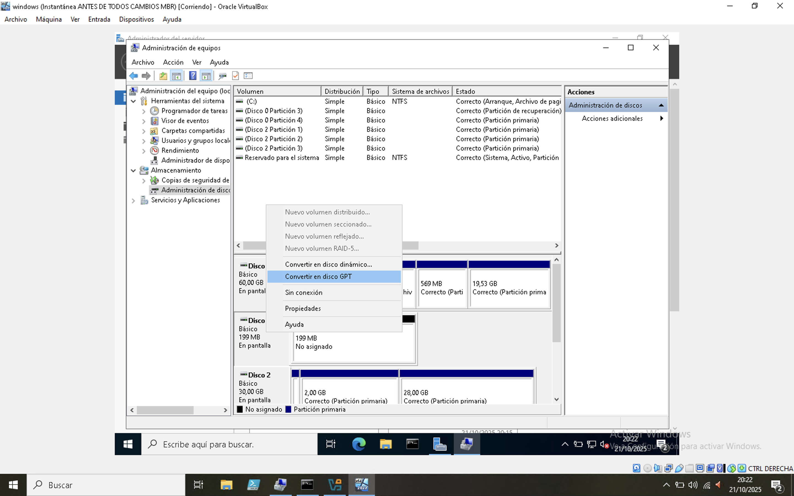
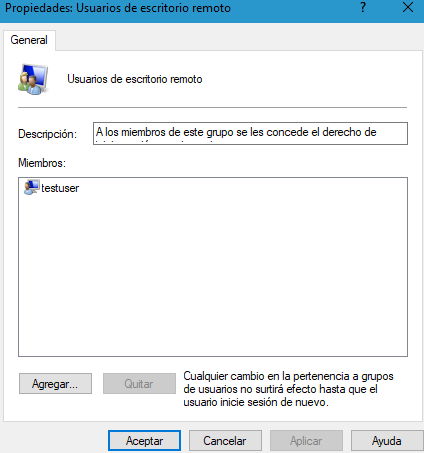
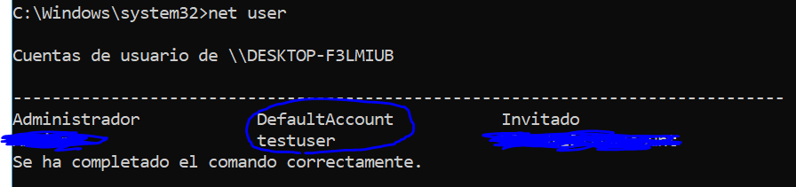

[**Clase siguiente →**](clase05.md)

[**← Clase anterior**](clase03.md)

# 💻 CLASE 4
## 📎 TEORÍA
### SOBRE LOS ARRANQUES...
**RECOMENDACIONES:** si bien antes se podían hacer cosas chulas como arrancar máquinas virtuales de forma nativa, recientemente este tipo de  arranques duales en Windows ya no funcionan tan bien. Así que, podemos seguir unas cuantas recomendaciones al respecto...

- Lo mejor es crear máquinas virtuales con SO independientes
- El arranque dual en el equipo anfitrión tendría sentido si nuestro ordenador no fuera muy potente. Sino, tampoco es algo muy necesario, aunque lo podemos hacer para practicar.
- Si quisiésemos tener 2 SO en una máquina virtual, añadiríamos dos discos, cada uno con un SO, y arrancaríamos con la BIOS (F12) de la máquina virtual eligiendo el SO que queramos. *Repito, guay para practicar y bichear, pero no es algo que tenga ya mucho sentido.*

**MBR2GPT:** En la instalación de Windows (física o virtual) > Abre el símbolo del sistema y ejecuta mbr2gpt /validate para ver si el disco es convertible a GPT.

**mbr2gpt puede usarse para:**
- **Convertir cualquier disco del sistema conectado con formato MBR al formato de partición GPT**. La herramienta no se puede usar para convertir discos que no son del sistema de MBR a GPT.
- **Convierta un disco MBR con volúmenes cifrados con BitLocker siempre y cuando se suspenda la protección**. Para reanudar BitLocker después de la conversión, los protectores existentes deben eliminarse y volver a crearse.

 

**WLS (Windows Subsystem for Linux):** es una característica de Windows que permite ejecutar un entorno Linux completo dentro de Windows, sin necesidad de usar una máquina virtual o un arranque dual (*¡qué chulo!*). Así puedes usar comandos, herramientas y aplicaciones de Linux (como Bash, apt, ssh, git, etc.) directamente desde Windows.

Esto tiene unas cuantas ventajas:
- Ejecuta distribuciones Linux como Ubuntu, Debian, Kali, Fedora, etc.
- Permite acceder a los archivos de Windows desde Linux y viceversa
- Piensa que esto es súper útil para programadores, administradores de sistemas o estudiantes que usan ambos sistemas. 

### ADMINISTRACIÓN DE USUARIOS Y GRUPOS
**TIPOS DE PERFILES** 
En Windows, existen varios tipos de perfiles de usuario que determinan cómo se guardan las configuraciones y los datos del usuario.
- **Perfil de Usuario ->**  colección de carpetas y datos que definen el entorno de un usuario y sus configuraciones (*almacenadas en AppData*). Son perfiles locales por defecto.
- **Perfiles móviles (Roaming Profiles) ->** el perfil del usuario se almacena en un servidor y se descarga automáticamente cada vez que inicia sesión en un equipo de la red.
- **Perfiles obligatorios (Mandatory Profiles) ->** una versión del perfil móvil que no guarda los cambios del usuario. Son solo de lectura.

*Para optimizar los perfiles móviles, se usa la **Redirección de carpetas**, que hace que carpetas pesadas como "Mis Documentos" apunten directamente a una ruta de red, en lugar de sincronizarse al iniciar y cerrar sesión. Finalmente, los scripts de inicio de sesión son pequeños programas o scripts (ej. un .bat) que se ejecutan automáticamente cada vez que un usuario inicia sesión, permitiendo realizar tareas como mapear unidades de red.*

*Los scripts de inicio de sesión se suelen almacenar en una carpeta compartida especial en los controladores de dominio llamada **NETLOGON**. Cualquier script que pongas ahì será accesible para los equipos cliente durante el proceso de inicio de sesión.*

## 📎 ALGUNOS TIPS
👉 **¿Cómo instalo wsl?**

Se puede hacer de dos formas:

- Desde el Power Shell o el CMD y como administrador, ejecutamos el comando `wsl --install` > Reiniciamos > Verificamos que está instalado con `wsl --list --verbose`.

- Abrimos el menú de **Características de Windows** (*está en el Panel de Control*) > Marca las opciones de **Subsistema de Windows para Linux** y **Plataforma de máquina virtual** > Aceptar > Reinicia y verifica.

*Se instala Ubuntu por defecto. En la Windows Store podéis elegir otra distro, o mirar desde el CMD/Power Shell las distros disponibles con `wsl --list --online`y elegir `wsl --install -d <Distro>`

👉 **¿Cómo creo un nuevo usuario?**
1. Introducimos en el cmd el comando lusrmgr.msc

2. En Usuarios click dcho --> Usuario nuevo -->  Ponemos por ejemplo el nombre y contraseña que nos pone en el aula práctica (*testuser*) (*contraseña que queramos*)

3. Este nuevo usuario lo metemos en el grupo de Usuarios de escritorio remoto :arrow_right:  *Propiedades > Miembro de > agregar > Escribimos el nombre TAL CUAL*

4. Finalmente nos aparecerá el nuevo usuario **testuser** en el grupo **Usuarios de escritorio remoto** tal y como se ve en esta imagen:

Podéis comprobarlo desde el CMD y el Power Shell:
- **CMD** `net user` = te dice los usuarios que están creados en nuestro equipo
- **Power Shell** `Get-LocalUser` = te dice los usuarios que están creados en nuestro equipo

## 📎 TAREAS
📌 **Windows Server**
- No seas merluzo y si no lo has hecho, instálate WS de una vez :D

📌 **WSL**
- Intenta instalarte WSL
- Ayuda: https://www.youtube.com/watch?v=L4f1XHrSJEg 

## 📎 EXTRAS
- Más info sobre los hashes ->  https://www.jesusninoc.com/01/27/creacion-de-hashes-de-contrasena-nt4/
- Saber más de contraseñas en el Directorio Activo -> https://www.semperis.com/es/blog/ntds-dit-extraction-explained/

**Caín y Abel**
- Si alguien quisiese instalarse Cain y Abel, pedírselo directamente a Jesús y os mandará el software, o preguntarle cosas... Ojo, es un software un poco raro, el antivirus lo puede matar -> https://github.com/jesusninoc/Cain
- Vídeo sobre cómo instalar Cain & Abel https://www.youtube.com/watch?v=My_X6_Jbwp0
- Vídeo sobre cómo ver usuarios del Directorio Activo desde Cain & Abel https://www.youtube.com/watch?v=a4xPdwrnK_I
- Enlace para descargar Cain & Abel https://github.com/jesusninoc/Cain/tree/master

 

[**Clase siguiente →**](clase05.md)

[**← Clase anterior**](clase03.md)